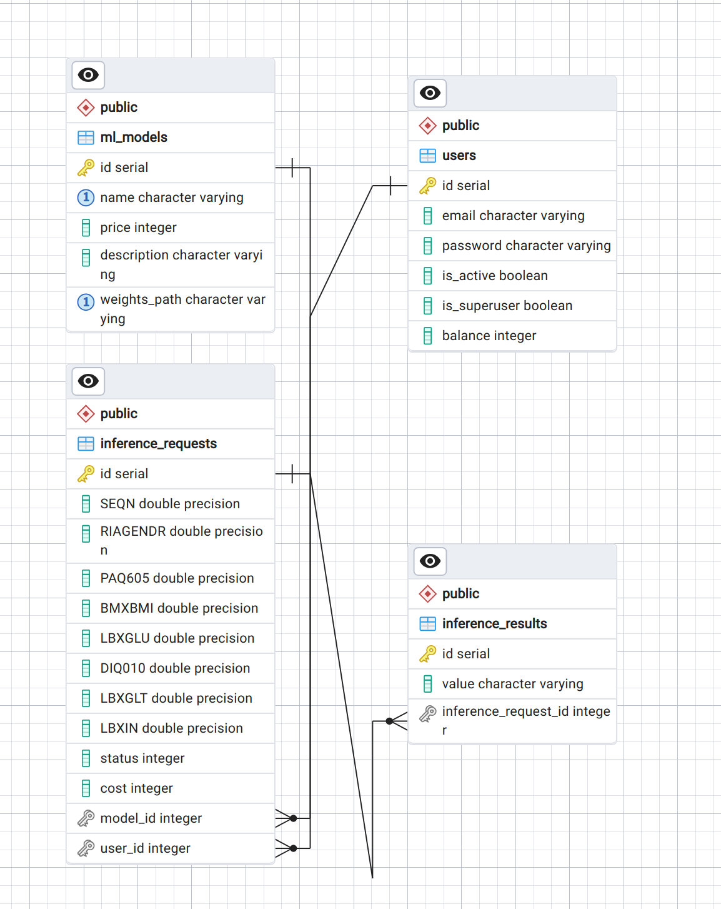

## Models billing

Запуск:

`docker-compose up -d`

Открыть в браузере:

`127.0.0.1:8050`

Демонстрация работы всего приложения:

[ссылка](https://drive.google.com/file/d/15T7HT2yLlSVwE06UaOgocmt2a6yWJ4bL/view?usp=sharing)

Схема api:

`openapi.yaml`

ER диаграмма базы данных:

